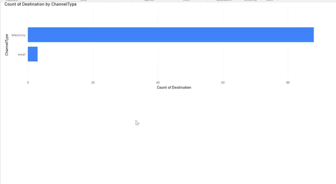

## Integrating Webex Contact Center with Microsoft Power BI

### Executing GraphQL Search API calls using Spring Boot

This is a sample web application to convert the WebexCC GraphQL search API string into web connector endpoint for external reporting sources such as Microsoft's Power BI. It uses a simple Spring Boot web application to expose a controller for the endpoint used by Power BI.

The application can be modified, enhanced or extended to fit the use cases required.

Watch the demo below to understand what this application does and how to set it up and extend on it.

## [Watch Now: Integrating Webex Contact Center with Power BI - Sample Spring Boot Application](https://app.vidcast.io/share/6fd7cd09-7930-488c-9f02-0baa13f1d0e3)

> **Note:** This is a sample that assumes you know the basics of GraphQL Search String API as well as Java/Spring Boot.

> This demo goes over the Java sample code that is used to connect Webex Contact Center with Microsoft Power BI. The code exports the Webex Contact Center reporting data available on the GraphQL "Search" API to a Web interface consumable by Microsoft Power BI. It leverages the power of Spring Boot to make this consumable by any external data lake.

## Developer Documentation

**https://developer.webex-cx.com/documentation/search**

## Getting Started

The application can be hosted on any Java VM environment and covers how this is done by building and hosting the application on localhost.

### Executing the sample

How to run the sample application:

**Step 1:**

- Download / Clone the repository and go to [graphql-powerbi-sample](https://github.com/CiscoDevNet/webex-contact-center-api-samples/graphql-powerbi-sample)

**Step 2:**

- Modify the property file under
  `/src/main/resources/application.properties`

- Add the details such as the client_id, client_secret, redirect_uri. For more information on how to configure these parameters, refer to the basic samples in the repository.

**Step 3:**

- Install the dependencies using: `mvn clean install`

**Step 4:**

- Run the application locally using: `java -jar graphql-sample-java-0.0.1-SNAPSHOT.jar`
- This should run the app on `http://localhost:8080`

**Additional Improvements:**

- You can modify the application as required.

## Useful Links - Supplemental Resources

- [Getting Started with GraphQL /search API](https://github.com/CiscoDevNet/webex-contact-center-api-samples/tree/main/graphql-sample)

- [GraphQL APIs Search Tasks](https://developer.webex-cx.com/documentation/search/v1/search-tasks)

- [My Apps](https://developer.webex-cx.com/my-apps)

## Disclaimer

> These samples are meant to be used, as "samples", for demos, and to understand how to interact with the WebexCC APIs.
> When building a production grade solution, please consider the overall architecture and design with a security first approach.
> Also, please consider how you would extend this app for multiple orgs, manage tokens for the orgs, etc.
> These samples are only meant to provide working, starter code and many layers have been simplified and abstracted away to focus on the Webex Contact Center use cases.

## Support

For dedicated Developer Support on the APIs - Please open a ticket with the team using this link: **[Webex Contact Center Developer Support](https://developer.webex-cx.com/support)**

For discussions on the samples, feel free to participate in our Developer Community:

**[Webex Contact Center APIs Developer Community](https://community.cisco.com/t5/contact-center/bd-p/j-disc-dev-contact-center)**

Refer: **[How to Ask a Question or Initiate a Discussion](https://community.cisco.com/t5/contact-center/webex-contact-center-apis-developer-community-and-support/m-p/4558270)**

## Version History

- 0.0.1

  - Beta version with basic REST API GraphQL queries to Search Tasks
